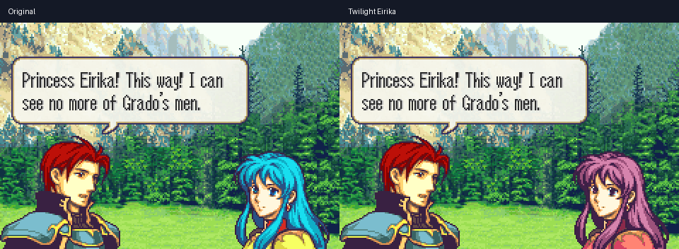

# Fire Emblem: The Sacred Stones (USA)

This repository reconstructs the USA Game Boy Advance release of *Fire Emblem: The Sacred Stones* from source and tracked assets. A default `make compare` build produces `fireemblem8.gba` and verifies the expected image checksum: `c25b145e37456171ada4b0d440bf88a19f4d509f`.

The completion record describes the audited source inventory, explicit hardware operations, exact-build evidence, and remaining classification uncertainty. Read [Native Source Completion](docs/native-source-completion.md) for the scope and evidence.

## Project lineage

This work started from the FEUniverse project at revision `ecc6798b` and incorporates data-recovery work from laqieer's fork at `7b47dec8`. The embedded FE6 serial-link payload uses StanHash's [mgfembp](https://github.com/StanHash/mgfembp); this repository includes a source-only Git bundle that restores the locally pinned payload revision.

## Demos

Browse the [demo overview](demos/README.md) and the source for each showcase:

- [Balance](demos/balance/README.md)
- [Resolve](demos/resolve/README.md)
- [Visual](demos/visual/README.md)

[Download the playable patches and videos](https://github.com/alachhman/fireemblem8u/releases/tag/showcase-v1). Each demo includes source changes and real emulator footage.

## Build

Start with the [quickstart guide](docs/quickstart.md). A copy of the original ROM is not required for the source build.

## Upstream projects

- [FEUniverse/fireemblem8u](https://github.com/FireEmblemUniverse/fireemblem8u) — original decompilation project
- [laqieer/fireemblem8u](https://github.com/laqieer/fireemblem8u) — data-recovery work incorporated by this checkout
- [StanHash/mgfembp](https://github.com/StanHash/mgfembp) — embedded FE6 serial-link payload
