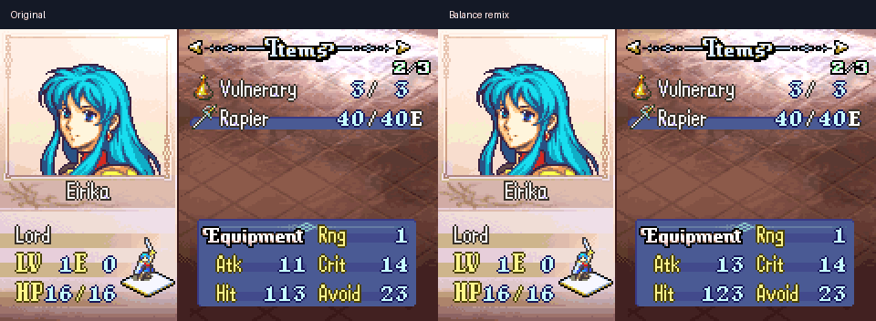
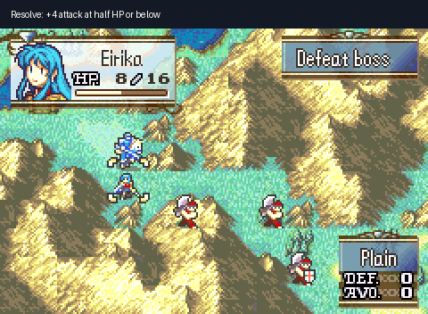

# Sacred Stones mod showcase

Three independent, source-built examples: weapon balance, a combat rule, and a portrait palette. Each starts from the same verified USA baseline. **Apply one patch to a clean baseline; do not stack these patches.**

[Download all three patches and videos](https://github.com/alachhman/fireemblem8u/releases/tag/showcase-v1).

## Balance remix

Rapier might rises from 7 to 9 and hit from 95 to 105; Iron Sword might and Eirika's HP/strength growths also increase. The opening inventory shows attack **11 → 13** and hit **113 → 123**.



[Source and exact values](balance/README.md) · [BPS patch](releases/balance.bps) · [Video](media/balance.mp4)

## Resolve: a new combat rule

Eirika gains **+4 attack at half HP or below**. The included training setup starts her at 8/16 HP and places an 11-HP fighter nearby. Move two tiles right, then attack downward. The recorded forecast shows 9 damage per strike on mountain terrain; the captured fight ends with the fighter defeated and Eirika alive. Outcomes can vary with your inputs and random-number state.



[Source and boundary checks](resolve/README.md) · [BPS patch](releases/resolve.bps) · [Video](media/resolve.mp4)

## Twilight Eirika

Purple hair and crimson clothing in Eirika's normal dialogue portrait, with skin and pale highlights preserved. This changes the portrait palette, not her battle sprite.


[Palette source and installer](visual/README.md) · [BPS patch](releases/visual.bps) · [Video](media/visual.mp4)

## Play

Use a clean USA image with SHA-1 `c25b145e37456171ada4b0d440bf88a19f4d509f`. You can build it from this repository using the [quickstart](../docs/quickstart.md), or use your own matching image. These downloads contain patches, not complete ROMs.

Apply a patch with Floating IPS, or the included Python tool:

```sh
python3 demos/tools/bps.py apply original.gba demos/releases/resolve.bps resolve.gba
```

Open the resulting image in a GBA emulator and start a **new Normal-mode game**. Skip the opening scenes to reach the training encounter. For the portrait comparison, keep the opening dialogue visible. Each download has a JSON receipt with source, target, and patch hashes.

## Build the examples

First prepare a separate checkout following the quickstart and verify `make compare`. Then run from the checkout containing these demo files:

```sh
python3 demos/build.py resolve --checkout /path/to/prepared-checkout --output /path/to/local-output
```

Replace `resolve` with `balance` or `visual`. The runner verifies the baseline, applies the demo, builds and checks the BPS round trip, then restores the affected files and verifies the matching baseline again. Use an idle checkout; do not edit it during this process. The output includes a local ROM, ELF, map, logs, patch and receipt. Only patches and receipts are distributed here.

Optional `--flips /path/to/flips` uses Floating IPS for smaller delta patches. The published Resolve patch uses this encoder; the built-in encoder produces the same target with a larger patch.

## Verification and limits

All three variants were built, applied independently with Floating IPS, and compared byte for byte with their compiled targets. The baseline was restored and compared after each build. Resolve has 13 passing host-side boundary tests. Real mGBA footage demonstrates the opening screens and one Resolve encounter. This is a focused showcase, **not a full-campaign playtest or a claim of portable C throughout the decompilation**.

[Verification record](verification.json) · [Capture reproduction](capture_inputs/README.md) · [Decompilation scope](../docs/native-source-completion.md)
